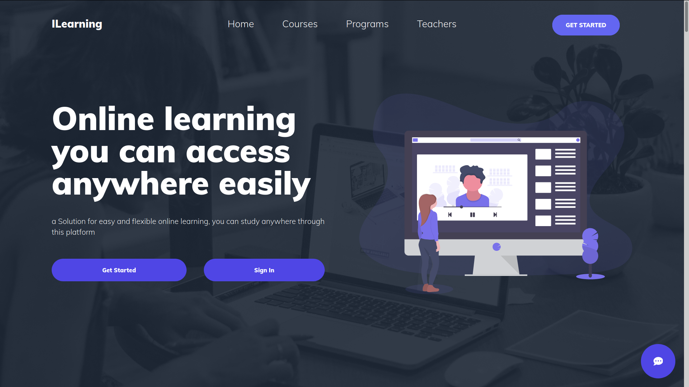

<div id="top"></div>
<!--
*** Thanks for checking out the Best-README-Template. If you have a suggestion
*** that would make this better, please fork the repo and create a pull request
*** or simply open an issue with the tag "enhancement".
*** Don't forget to give the project a star!
*** Thanks again! Now go create something AMAZING! :D
-->

<!-- PROJECT SHIELDS -->
<!--
*** I'm using markdown "reference style" links for readability.
*** Reference links are enclosed in brackets [ ] instead of parentheses ( ).
*** See the bottom of this document for the declaration of the reference variables
*** for contributors-url, forks-url, etc. This is an optional, concise syntax you may use.
*** https://www.markdownguide.org/basic-syntax/#reference-style-links
-->
[![Contributors][contributors-shield]][contributors-url]
[![Forks][forks-shield]][forks-url]
[![Stargazers][stars-shield]][stars-url]
[![Issues][issues-shield]][issues-url]
[![MIT License][license-shield]][license-url]

<!-- PROJECT LOGO -->
<br />
<div align="center">
  <!-- <a href="https://github.com/GuysKapen/ELearningLaravel">
    
  </a> -->

<h3 align="center">ILearning</h3>

  <p align="center">
    An E-Learning Website with Chatbox
    <br />
    <a href="https://github.com/GuysKapen/ELearningLaravel"><strong>Explore the docs »</strong></a>
    <br />
    <br />
    <a href="https://github.com/GuysKapen/ELearningLaravel">View Demo</a>
    ·
    <a href="https://github.com/GuysKapen/ELearningLaravel/issues">Report Bug</a>
    ·
    <a href="https://github.com/GuysKapen/ELearningLaravel/issues">Request Feature</a>
  </p>
</div>

<!-- TABLE OF CONTENTS -->
<details>
  <summary>Table of Contents</summary>
  <ol>
    <li>
      <a href="#about-the-project">About The Project</a>
      <ul>
        <li><a href="#built-with">Built With</a></li>
      </ul>
    </li>
    <li>
      <a href="#getting-started">Getting Started</a>
      <ul>
        <li><a href="#prerequisites">Prerequisites</a></li>
        <li><a href="#installation">Installation</a></li>
      </ul>
    </li>
    <li><a href="#usage">Usage</a></li>
    <li><a href="#roadmap">Roadmap</a></li>
    <li><a href="#contributing">Contributing</a></li>
    <li><a href="#license">License</a></li>
    <li><a href="#contact">Contact</a></li>
    <li><a href="#acknowledgments">Acknowledgments</a></li>
  </ol>
</details>

<!-- ABOUT THE PROJECT -->
## About The Project



### Built With

* [![Laravel][Laravel.com]][Laravel-url]
* [![JQuery][JQuery.com]][JQuery-url]

<!-- GETTING STARTED -->
## Getting Started

This is an example of how you may give instructions on setting up your project locally.
To get a local copy up and running follow these simple example steps.

### Prerequisites

This is an example of how to list things you need to use the software and how to install them.

* PHP 7.3 | 8.0
* PostgreSQL
* Composer

Download and install Composer by following the official instructions.

  ```sh
  composer install
  ```

### Installation

1. Clone the repo

   ```sh
   git clone https://github.com/GuysKapen/ELearningLaravel.git
   ```

2. Install NPM packages

   ```sh
   npm install
   ```

3. Create database in postgresql

   ```sh
   database create elearning;
   ```

4. Modify credetials (username, password) in .env file

   ```sh
   DB_USERNAME=username
   DB_PASSWORD=password
   ```

5. Cd to project and run migration

   ```sh
   cd /path/to/project
   php artisan migrate
   ```

6. Start server and browse in browsers

   ```sh
   php artisan serve
   ```

### Deployment (On Fly)

1. Create and link a new postgres database

    ```sh
    flyctl postgres create
    flyctl postgres link <database-name>
    ```

2. Config env variables with flyctl (database connections, mail connections, etc ...)

    ```sh
    flyctl secrets set ...
    ```

3. Connect to the app to run migrate, link storage

    ```sh
    flyctl ssh console
    cd /var/www/html
    php artisan migrate
    php artisan storage:link
    ```
<!-- USAGE EXAMPLES -->
## Usage

* For Developers:
  * Clone repo and start development as with Laravel
  * Add more author and student features
  * Add API for REST

* For Users:
  * Add courses, quizzes to website and host it online
  * Add more meta data such as categories, tags, ...

<!-- ROADMAP -->
## Roadmap

* [x] Admin
  * [x] Courses
  * [x] Categories
  * [x] Languages
  * [x] Programming Languages
  * [x] Approve and Notification
* [x] Author
  * [x] Dashboard
  * [x] Courses
  * [x] Tools
  * [x] Resources
  * [x] Profile
* [x] Student
  * [x] Search Course
  * [x] Enroll/Buy Course
  * [x] Do Quiz
  * [x] Course Result
* [x] Course creation
  * [x] Landing
  * [x] Curriculum
  * [x] Assessment
  * [x] Pricing
  * [x] Metadata
* [x] Quiz feature
  * [x] Auto save answer
  * [x] Persistent do quiz session after logout
  * [x] Allow preview answer

See the [open issues](https://github.com/GuysKapen/ELearningLaravel/issues) for a full list of proposed features (and known issues).

<!-- CONTRIBUTING -->
## Contributing

Contributions are what make the open source community such an amazing place to learn, inspire, and create. Any contributions you make are **greatly appreciated**.

If you have a suggestion that would make this better, please fork the repo and create a pull request. You can also simply open an issue with the tag "enhancement".
Don't forget to give the project a star! Thanks again!

1. Fork the Project
2. Create your Feature Branch (`git checkout -b feature/AmazingFeature`)
3. Commit your Changes (`git commit -m 'Add some AmazingFeature'`)
4. Push to the Branch (`git push origin feature/AmazingFeature`)
5. Open a Pull Request

<!-- LICENSE -->
## License

Distributed under the MIT License. See `LICENSE.txt` for more information.

<!-- CONTACT -->
## Contact

Guys - guyskapen@gmail.com

Project Link: [https://github.com/GuysKapen/ELearningLaravel](https://github.com/GuysKapen/ELearningLaravel)

<!-- ACKNOWLEDGMENTS -->
## Acknowledgments

* [Laravel](https://laravel.com/)
* [TailwindCSS](https://tailwindcss.com/)
* [NPM](https://www.npmjs.com/)
* [Composer](https://github.com/composer/composer)

<!-- MARKDOWN LINKS & IMAGES -->
<!-- https://www.markdownguide.org/basic-syntax/#reference-style-links -->
[contributors-shield]: https://img.shields.io/github/contributors/GuysKapen/ELearningLaravel.svg?style=for-the-badge
[contributors-url]: https://github.com/GuysKapen/ELearningLaravel/graphs/contributors
[forks-shield]: https://img.shields.io/github/forks/GuysKapen/ELearningLaravel.svg?style=for-the-badge
[forks-url]: https://github.com/GuysKapen/ELearningLaravel/network/members
[stars-shield]: https://img.shields.io/github/stars/GuysKapen/ELearningLaravel.svg?style=for-the-badge
[stars-url]: https://github.com/GuysKapen/ELearningLaravel/stargazers
[issues-shield]: https://img.shields.io/github/issues/GuysKapen/ELearningLaravel.svg?style=for-the-badge
[issues-url]: https://github.com/GuysKapen/ELearningLaravel/issues
[license-shield]: https://img.shields.io/github/license/GuysKapen/ELearningLaravel.svg?style=for-the-badge
[license-url]: https://github.com/GuysKapen/ELearningLaravel/blob/master/LICENSE.txt
[linkedin-shield]: https://img.shields.io/badge/-LinkedIn-black.svg?style=for-the-badge&logo=linkedin&colorB=555
[linkedin-url]: https://linkedin.com/in/linkedin_username
[product-screenshot]: images/screenshot.png
[Next.js]: https://img.shields.io/badge/next.js-000000?style=for-the-badge&logo=nextdotjs&logoColor=white
[Next-url]: https://nextjs.org/
[React.js]: https://img.shields.io/badge/React-20232A?style=for-the-badge&logo=react&logoColor=61DAFB
[React-url]: https://reactjs.org/
[Vue.js]: https://img.shields.io/badge/Vue.js-35495E?style=for-the-badge&logo=vuedotjs&logoColor=4FC08D
[Vue-url]: https://vuejs.org/
[Angular.io]: https://img.shields.io/badge/Angular-DD0031?style=for-the-badge&logo=angular&logoColor=white
[Angular-url]: https://angular.io/
[Svelte.dev]: https://img.shields.io/badge/Svelte-4A4A55?style=for-the-badge&logo=svelte&logoColor=FF3E00
[Svelte-url]: https://svelte.dev/
[Laravel.com]: https://img.shields.io/badge/Laravel-FF2D20?style=for-the-badge&logo=laravel&logoColor=white
[Laravel-url]: https://laravel.com
[Bootstrap.com]: https://img.shields.io/badge/Bootstrap-563D7C?style=for-the-badge&logo=bootstrap&logoColor=white
[Bootstrap-url]: https://getbootstrap.com
[JQuery.com]: https://img.shields.io/badge/jQuery-0769AD?style=for-the-badge&logo=jquery&logoColor=white
[JQuery-url]: https://jquery.com
